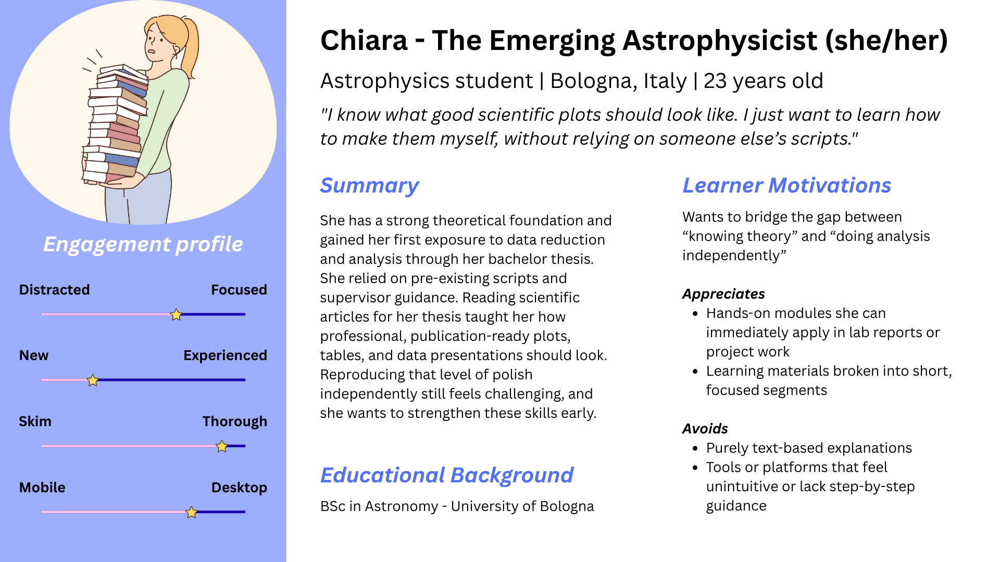
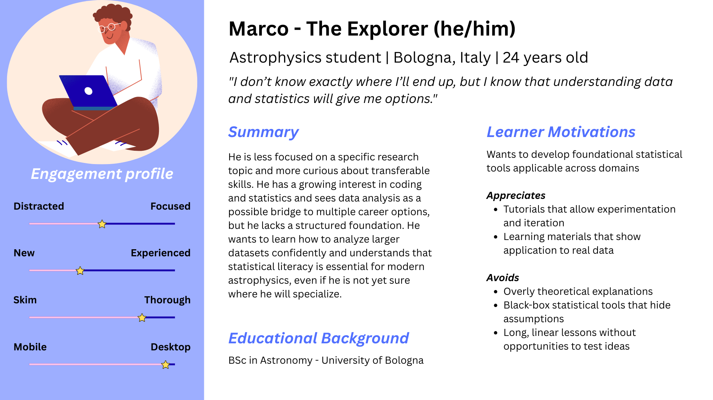

## Overview 
This repository contains a series of short, hands-on micro-tutorials designed to help Astronomy and Physics students develop practical data-analysis skills using Python and Jupyter notebooks.
The project was developed using learning experience design principles, informed by first-hand academic experience and informal faculty feedback.

## Design Principles

- Short, focused learning units (15–25 minutes);
- Hands-on practice over passive reading;
- Visual examples paired with reusable code;
- Alignment with real academic use cases.

## Tutorials
- Tutorial 1: Plotting with Matplotlib
- Tutorial 2: Introduction to Linear Regression
- Tutorial 3: Spectral Index Estimation (planned)

## Needs Assessment
Project: STEM Micro-Tutorials for Data Analysis in Physics & Astronomy

Context: University of Bologna

Designer: Giada Pignataro, PhD

1. Context and Purpose

This project addresses a recurring skills gap observed among MSc students in Astrophysics and Cosmology at the University of Bologna. The tutorials are designed as self-study resources, to be shared by supervisors and used independently by students before data-analysis courses or during thesis work. 
The assessment is informed by first-hand experience as a former student and by informal conversations with colleagues currently teaching and supervising in the field.

2. Learner Profile

The primary audience consists of first-year MSc students in Astrophysics and Cosmology, with secondary relevance for advanced Bachelor students. Class sizes are typically small (10–15 students), and resources are often delivered ad hoc to individual learners during lab activities or thesis supervision.

Learners typically:
- Have strong theoretical backgrounds;
- Possess basic familiarity with Python;
- Have minimal hands-on experience with data visualization and statistics;
- Use personal laptops with stable internet access.

3. Identified Skill Gaps

Despite theoretical preparation, students initially struggle with practical data-analysis skills required for labs and thesis work. 

Common gaps include:
- Producing clear and readable plots;
- Correct use of axes, labels, units, and color scales;
- Understanding and applying basic statistical concepts;
- Reliance on copied scripts without conceptual understanding

These gaps often result in:
- Slower progress during lab sessions;
- Confusing lab reports;
- Revisions and rework during thesis preparation;
- Increased dependency on supervisors for routine tasks.

4. Learning Environment and Constraints

Students typically engage with learning materials:
- Independently;
- In short time windows (15–25 minutes);
- Alongside other demanding coursework.

Therefore, learning resources must be:
- Concise and modular;
- Easy to access and navigate;
- Focused on immediate application.

5. Proposed Solution

To address these needs, this project proposes a series of short, focused Jupyter-based tutorials covering foundational data-analysis skills, including:
- Creating clear and well-styled plots with Matplotlib;
- Using scatter plots, colorbars, and histograms effectively;
- Introducing basic regression concepts from first principles;
- Performing simple fits relevant to astrophysical contexts;
- Interpreting results;

Each tutorial is designed to be completed in 15–25 minutes, with:
- Clear learning objectives;
- Step-by-step guidance;
- Visual examples;
- Code that can be reused in lab reports or thesis work;

6. Success Criteria and Evaluation

Success will be indicated by:
- Increased student confidence in working independently with data;
- Improved clarity and consistency in lab reports and thesis figures;
- Reduced need for corrective feedback from supervisors;
- Adoption or recommendation of materials by faculty.

Evaluation will be informal and qualitative, based on:
- Student questions and feedback;
- Supervisor observations;
- Reuse of materials in coursework and thesis projects;

7. Design Rationale

The tutorials are intentionally designed to bridge the gap between theoretical knowledge and applied practice, supporting learners as they transition toward more autonomous, research-oriented work. By focusing on realistic use cases and short learning segments, the project aligns with both learner needs and the practical constraints of academic environments.

## Learner Personas
To guide design decisions, two prepresentative learner personans were developed. 

### Chiara — The Emerging Astrophysicist
> "I know what good scientific plots should look like. I just want to learn how to make them myself, without relying on someone else’s scripts."

### Marco - The Explorer

> "I don’t know exactly where I’ll end up, but I know that understanding data and statistics will give me options."

